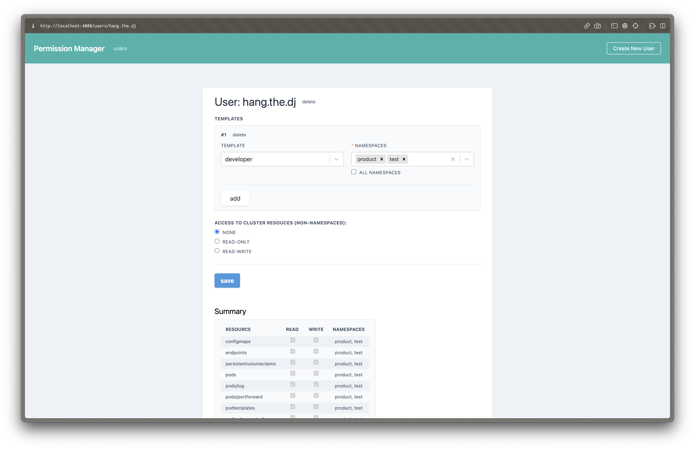

# Permission manager

Permission manager is an application that allow to create a user and a kubeconfig YAML file and assign permissions to operate within a namespace or globally via a web interface

## Screenshots

*First Page*


*Creating an user*



*Creating an user - Summary*


*User's kubeconfig*


## Installation

A guide on how to deploy permission manager is located at [installation](docs/installation.md)

## Development Setup

A detailed guide on how to contribute is located at [how-to-contribute](docs/how-to-contribute.md)

## FAQ

### How it works

The application allow to select some templates and associated them with an user, a naming convention is used to only show templates in the UI (see below for details)

the template system is an abstraction over cluter-roles, rolebinding and cluster roles bindigs, making the permissions "kubernetes native"

In a future version the naming convention will be changed using CRDs and k8s labels

### What is a template

A template is a clusterrole with the prefix

`template-namespaced-resources___`

for example
`template-namespaced-resources___developer`

#### why a template is not a CRD

at the time of development a template was one-to-one to a `clusterrole`, the usage of a CRD looked overkill, could could change in the future to avoid polluting `clusterrole`s and having a more precise incapsulation of what is owned by the permission manager

### How to add a new template

Crate a clusterrole starting with `template-namespaced-resources___` and apply it

#### default templates

`developer` and `operation` default templates can be created by applying the manifest located at _k8s/k8s-seeds/seed.yml_

```sh
kubectl apply -f k8s/k8s-seeds
```

### what is a user

a user is an custom resource of kind `permissionmanagerusers.permissionmanager.user`
